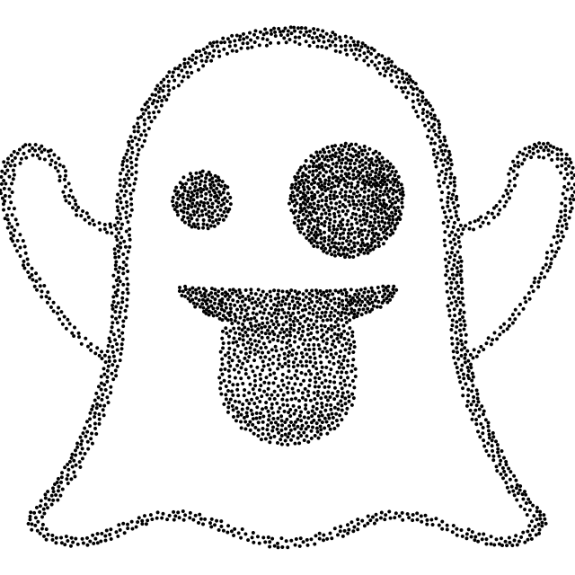
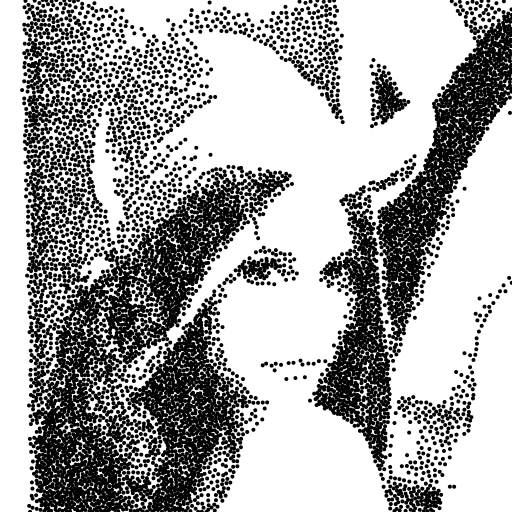
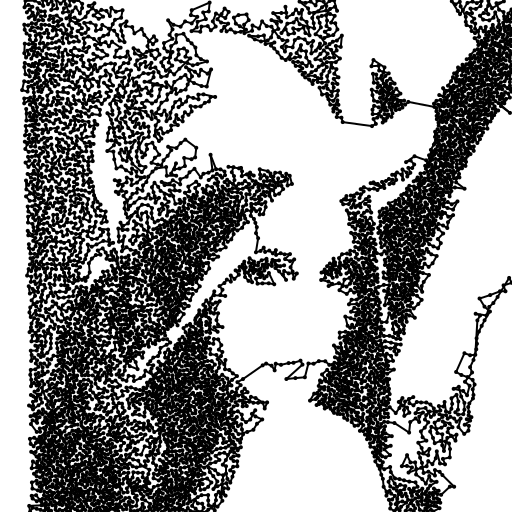
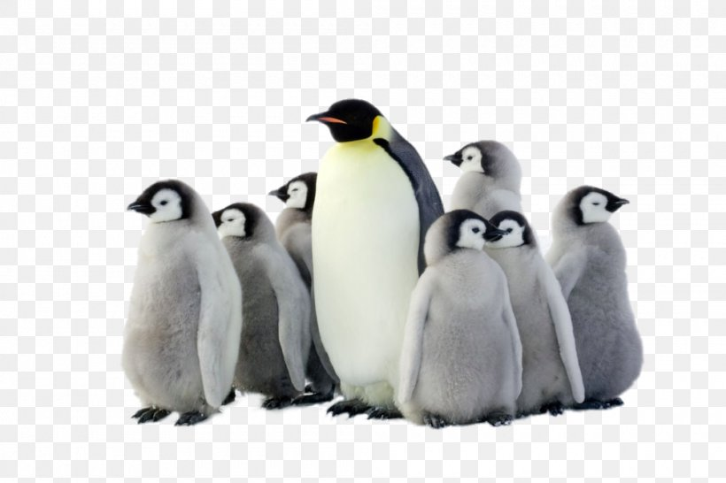
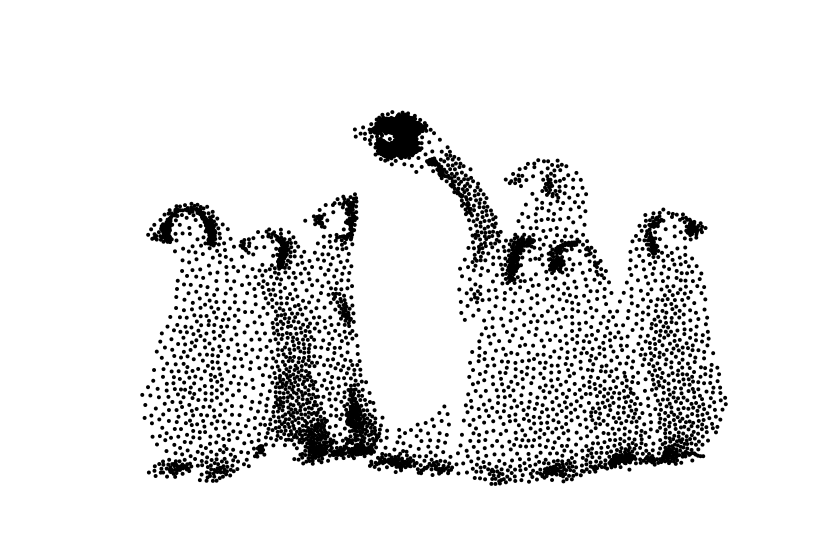
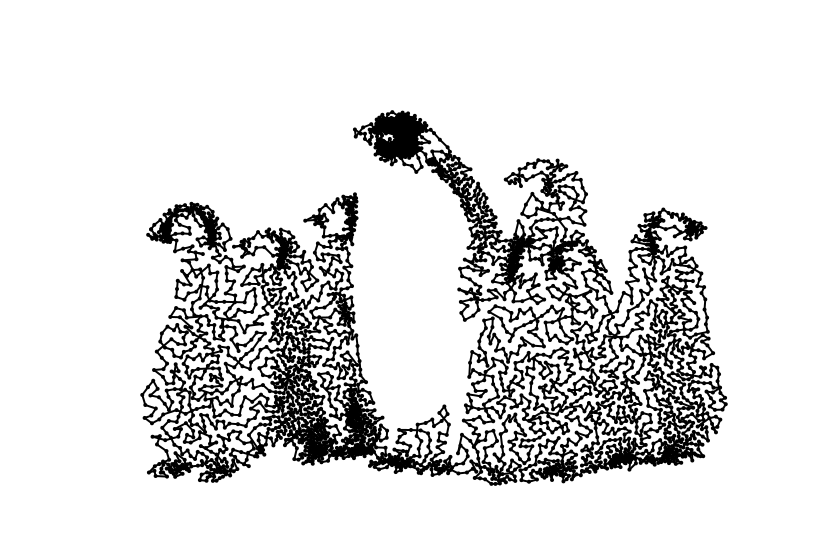
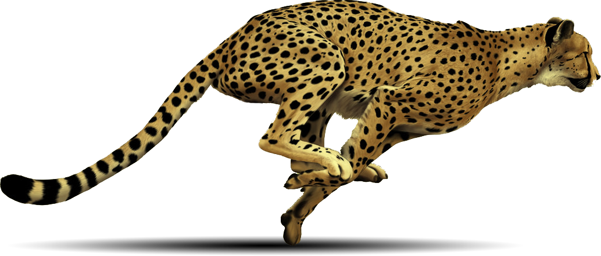
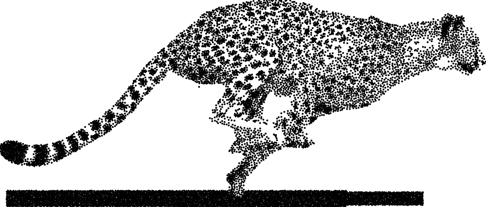

# tsp_art
Solves the travelling salesman problem (in an artistic way!)

Takes as input a png file and uses a modified Poisson-disk sampling method to stipple image, then treats the result as an instance of the metric tsp on a euclidean graph and finds an approximate solution using Christofides algorithm.

## Usage
(cmake is a work in progress so for now you need to manually compile and link, the output of the below comes from pkg-config so I'm not really sure what is needed)

~~~
$ g++ -std=c++14 -Wall -g -O3 renderer.cpp image.cpp poisson.cpp tsp.cpp -lcairo -I /usr/include/cairo -L/usr/local/lib -lopencv_gapi -lopencv_stitching -lopencv_aruco -lopencv_bgsegm -lopencv_bioinspired -lopencv_ccalib -lopencv_dnn_objdetect -lopencv_dnn_superres -lopencv_dpm -lopencv_highgui -lopencv_face -lopencv_freetype -lopencv_fuzzy -lopencv_hdf -lopencv_hfs -lopencv_img_hash -lopencv_line_descriptor -lopencv_quality -lopencv_reg -lopencv_rgbd -lopencv_saliency -lopencv_stereo -lopencv_structured_light -lopencv_phase_unwrapping -lopencv_superres -lopencv_optflow -lopencv_surface_matching -lopencv_tracking -lopencv_datasets -lopencv_text -lopencv_dnn -lopencv_plot -lopencv_videostab -lopencv_videoio -lopencv_xfeatures2d -lopencv_shape -lopencv_ml -lopencv_ximgproc -lopencv_video -lopencv_xobjdetect -lopencv_objdetect -lopencv_calib3d -lopencv_imgcodecs -lopencv_features2d -lopencv_flann -lopencv_xphoto -lopencv_photo -lopencv_imgproc -lopencv_core -o tsp_art
~~~

To invoke, use either of
~~~
$ ./tsp_art input.png lines_out.png
$ ./tsp_art input.png lines_out.png dots_out.png
~~~

(see below for how to tweak configuration)

## Part 1: Poisson Disk Sampling (PDS)

For visualization purposes, the problem to be solved here is to transforming the picture on the left into something like the picture on the right.

   
  

Treating each pixel as an indicator variable with probability proportional to its grayscale density would yield a truly random stippling of said image. However, such a method produces random clustering which is visually unappealing. Instead, computer graphics applications typically use a blue noise distribution, ie a white noise distribution with an enforced minimum distance between points; this produces a much better looking, but still random, stippling. Achieving said blue noise distribution is done many ways in practice but I chose to use PDS because it was the most intuitive to me, and since other methods such as weighted voronoi stippling and ordered dithering have already been used in similar projects.

### So what is Poisson Disk Sampling?

Mathematically, given an  image

a PDS, given a distance  is a a set

<a href="https://www.codecogs.com/eqnedit.php?latex=P=\left\{I_{ij}\mid\forall_{1\leq&space;k\neq&space;i\leq&space;m}\forall_{1\leq&space;h\neq&space;j\leq&space;n}\;\frac{||(i,j)-(k,h)||}{2}>r\right\}\subseteq&space;I" target="_blank">r\right\}\subseteq&space;I" title="P=\left\{I_{ij}\mid\forall_{1\leq k\neq i\leq m}\forall_{1\leq h\neq j\leq n}\;\frac{||(i,j)-(k,h)||}{2}>r\right\}\subseteq I" /></a>

such that the half distance between any two points is at least .

PDS is not often used in computer graphics due to historically poor time complexity, although this is not an issue with current implementations.

### My approach

My implementation of PDS was inspired by Robert Bridson's linear time algorithm (https://www.cs.ubc.ca/~rbridson/docs/bridson-siggraph07-poissondisk.pdf). Since this paper is freely available, I will merely summarize what changed between his algorithm and mine.

First and foremost, using PDS to stipple an image requires that  vary proportional to the local grayscale density of the image - this is what provides "color" in the pointillated picture, so let  be the local radius  around a point  wherein no other point may lie. Bridson's algorithm relies on the symmetry, given points , that

Instead, every point added needs to keep track of, and eliminate from consideration, all points with whom it would conflict with.

Secondly, it may be impossible for certain clusters of points to be reached from other clusters of points as the distance between them is so large, and the local radius so small, that the jump is impossible. To fix this, the image is preprocessed based on a user configurable mesh and percentile, and all points whose grayscale density is below the given percentile lying on the given points in the mesh are added to the queue (but not the stippling!)

The result of the above, plus several minor configurable tweaks yields a linear time algorithm that solves the weighted PDS problem in dimension 2 (although it is immediately generalizeable to any dimension). Interestingly, the only other way of solving this problem in linear time appears to be Cem Yuksel's 'Weighted Sample Elimination', which is a vastly different approach.

## Part 2: Christofides
The Travelling Salemen Problem is a famous problem in combinatorial optimzation which boils down to finding a minimum weight Hamilton cycle in a complete graph. As everyone probably knows, this is NP-HARD.

Can we approximate it? Not really, solving the tsp within any constant absolute or relative error is also NP-HARD (wait what?! how does Christofides work?!). Even solving the metric tsp is NP-HARD, but the good news is we can find (in 2-dimensions) a path that is atmost 50% longer than optimal under the assumption that the vertices satisfy the triangle inequality.

tsp_art contains a (nearly) complete implementation of Christofides algorithm, including a templated graph library alongside several other templated data structures. The only step currently missing is a minimum weight perfect matching solver so a call is made to Blossom V.
## Part 3: Rendering
tsp_art uses cairo, a c library, to do its rendering. The renderer class is a c++ style wrapper, and supports drawing of lines and circles.

## FAQ
### Why use Poisson Disk Sampling?
The Waterloo CO faculty (who did something similar, though they used the concorde solver) already used weighted voronoi stippling and ordered dithering, so I wanted to do something new.
### Why not implement minimum weight perfect matching myself?
I don't have a significant background in graph theory or combinatorial optimization, and did not want to simply copy an implementation. Expect the Blossom dependency to be dropped soon though.
### Why does the outputted image contain crossing lines?
Although it is known that an optimal solution to a metric tsp instance will be, geometrically, a non-crossing path, the solution obtained by Christofides will not neccesarily have this property. Most tsp art that can be found online solves the problem by feeding it into the Concorde tsp solver, which guarantees a non-crossing solution. If I can think of some efficient way to remove crosses from the path I will implement it, but this is currently on hold.
### I ran out of memory, what went wrong?
Usually this fails first on one of the graph algorithms, and it is because there are too many vertices. To fix this, change modify config.tsp_art by increasing min and max, decreasing max_thresh_p, or increasing either of .
### Whats next?
Mostly minor fixes
- Get cmake working
- In house blossom implementation
- Preprocess to get image-specific configuration
- Eliminate path crossings
## Examples / Configuration
The first step in the image processing is to scale the pixels from [0,255] into [min, max]. Then, every pixel  below the min_thresh_p'th percentile of grayscale intensity such that both  are divisible by mesh_diam is added to an initial points list.

The other 3 configuration options deal with point generation. When a point is chosen such that its grayscale intensity is above the max_thresh_p'th percentile, it is ignored. Finally, if  is a point with local density  then the disk of radius of  centered at  is removed from consideration.

   
  
  

   
  
  

   
  
  

